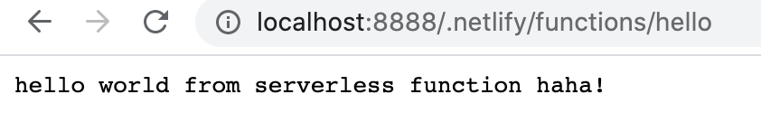

Steps to delopying a serverless function using netlify:

<style>
.code {
    white-space: pre;
    font-family: monospace;
}
</style>

1. Create a folder name "**test**"

2. Create a netlify account and connect it with your github account

3. Install netlify-cli globally by doing:
    **npm install netlify-cli -g**

3. Type **netlify login** on the terminal to enter your credentials

4. Insdie "**test**", create a simple html file with h1 tag as "Hello from netlify" and change the background color to display something like:

    

5. Next you need to test it before deploying to netlify to see if it works by typing:

    **netlify dev**

    It will ask you to provide a publish directory, then you can just hit enter for now

    Now on "http://localhost:8888", you should still see the above screen

6. Creat your first serverless function on netlify

    First, create a folder name "**functions**".
    
    Second, create a file named "**hello.js**" inside it, and paste in the following.

    exports.handler = async () => ({
        statusCode: 200,
        body: "hello world from serverless function haha!"
    })

    (The above code simply returns a message "hello world from serverless function haha!")

    Third, inside **test**, create a **netlify.toml** file to configure netlify, paste in the following:

    ```
    [build]
    functions = "functions"
    ```

    Now, save everything and keep the server running, and go to "**http://localhost:8888/.netlify/functions/hello**"

    You should see the following 👇:

    

    now we can delopy our site as well as our serverless function on netlify by typing:

    **netlify deploy**

    (This is give you a draft url for you to review, like the following)

    Website Draft URL: https://5f8bbc9aee6ba047d9ef9279--eddie-test.netlify.app


    If everything looks good on your draft URL, deploy it to your main site URL with the --prod flag.

    **netlify deploy --prod**

    Now you should be able to see your site something like:

    Website URL:       https://eddie-test.netlify.app

7. Accessing your serverless function on netlify.

    Netlify serverless functions are normally have the following url path: 

    https://eddie-test.netlify.app/.netlify/functions/hello

    The first part **https://eddie-test.netlify.app/** is your website address and the second part **.netlify/functions/hello** is to access your netlify serverless functions 

    The above path should take you to your serverless function:

    

    However, that url path does not seem too professional, we can do some rewrites to it.

    On your **netlify.toml** file, add the following

     ```
    [[redirects]]
        from = "/api/*"
        to = "/.netlify/functions/:splat"
        status = 200
     ```